# BLDR

### A project I made as a group with Ethan Midgley, Max Diven, Kieran Ballard & Jonasz Gofron, for CS317, Mobile App Development with University of Strathclyde

#### 1. Login screen

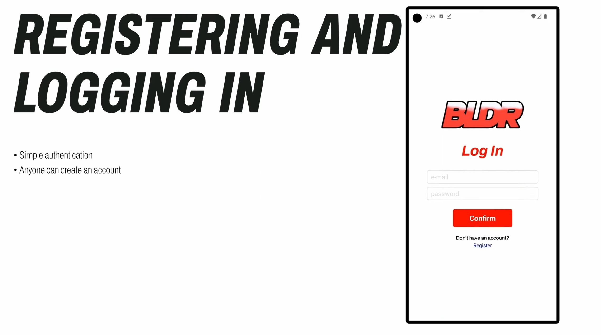

#### 2. Register screen

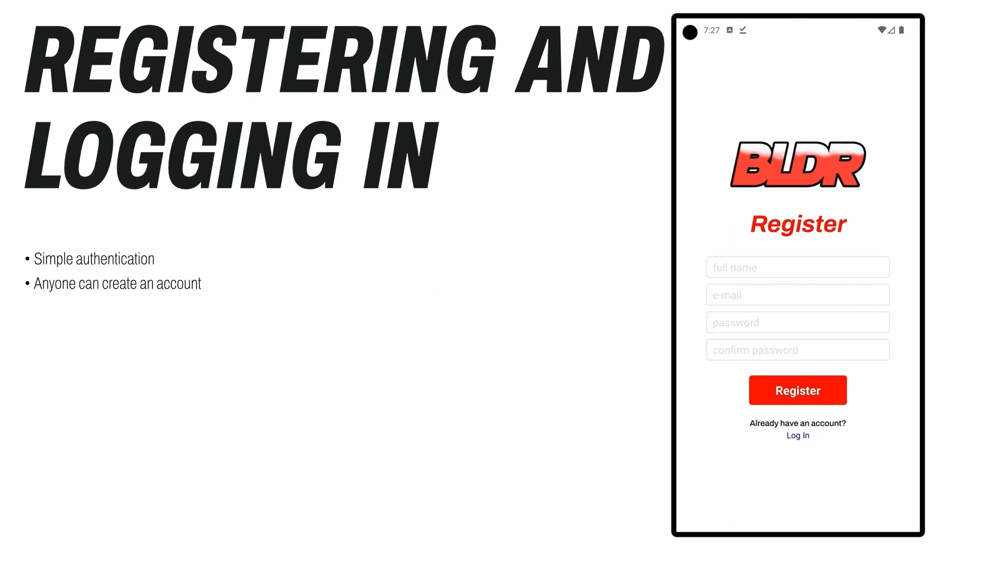

#### 3. Home page

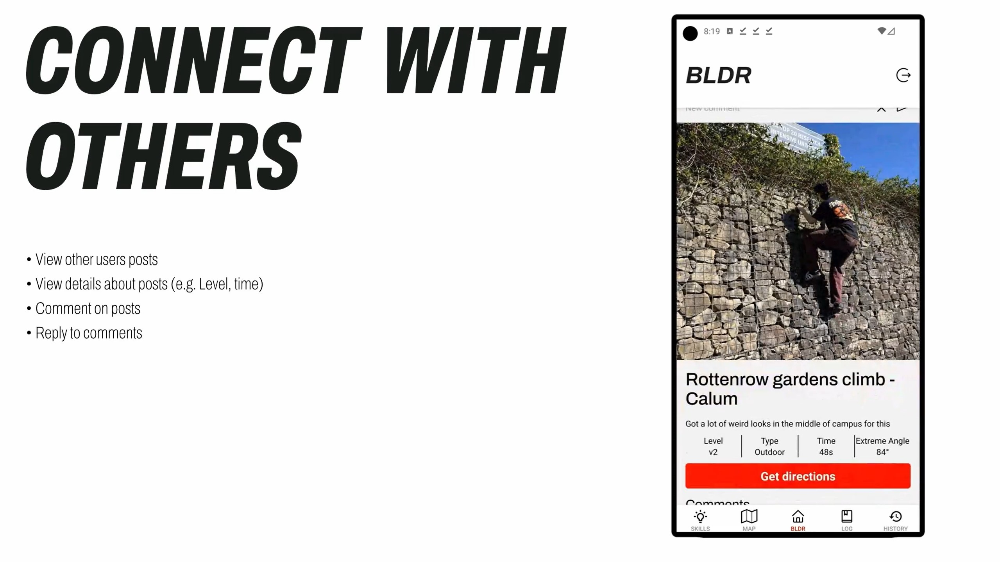

#### 4. Reply to comment

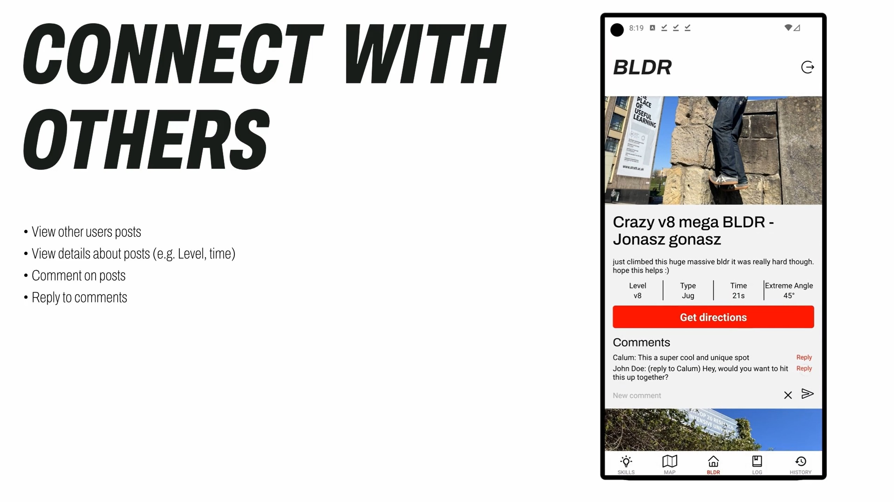

#### 5. Skills page

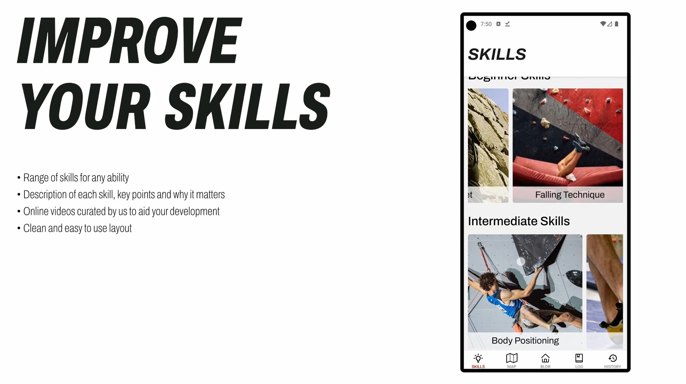

#### 6. Skill view

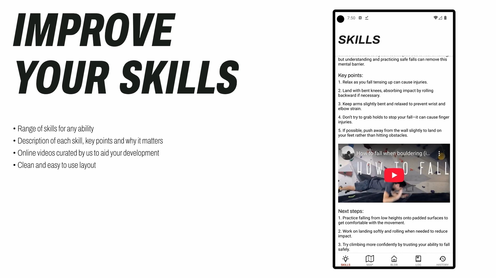

#### 7. Map screen

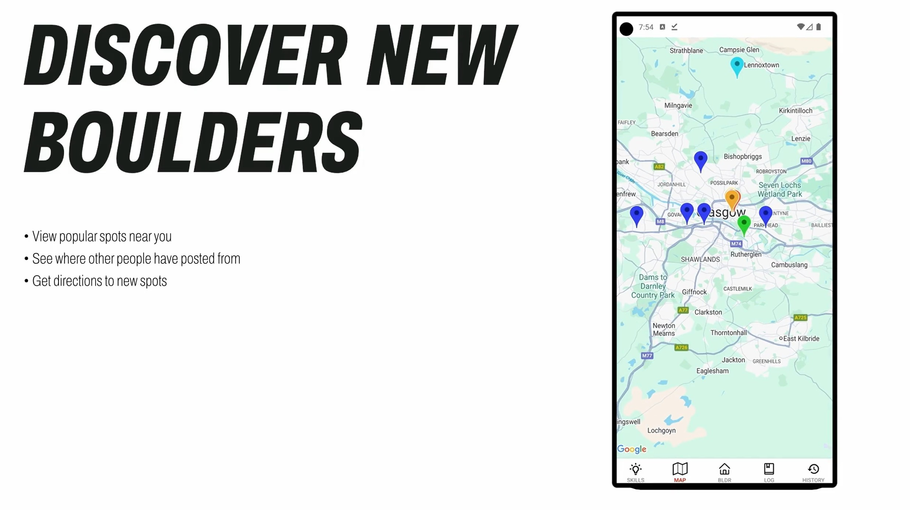

#### 8. Map post view

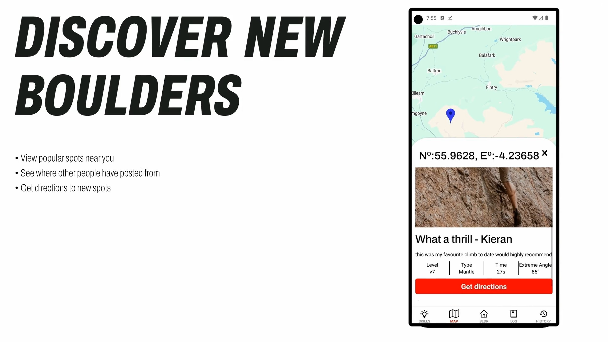

#### 9. Map location view

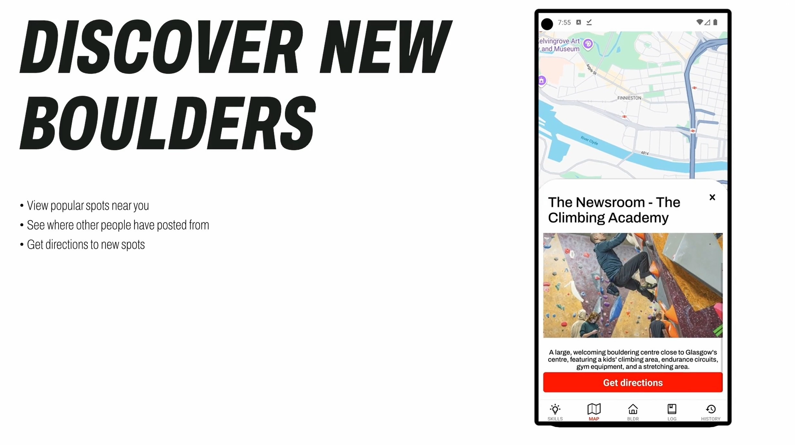

#### 10. Log screen

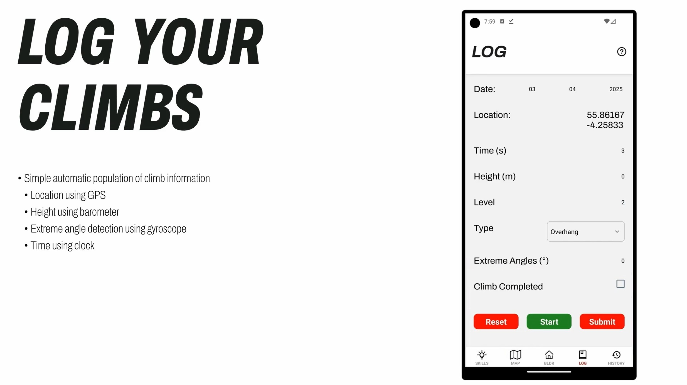

#### 11. History screen

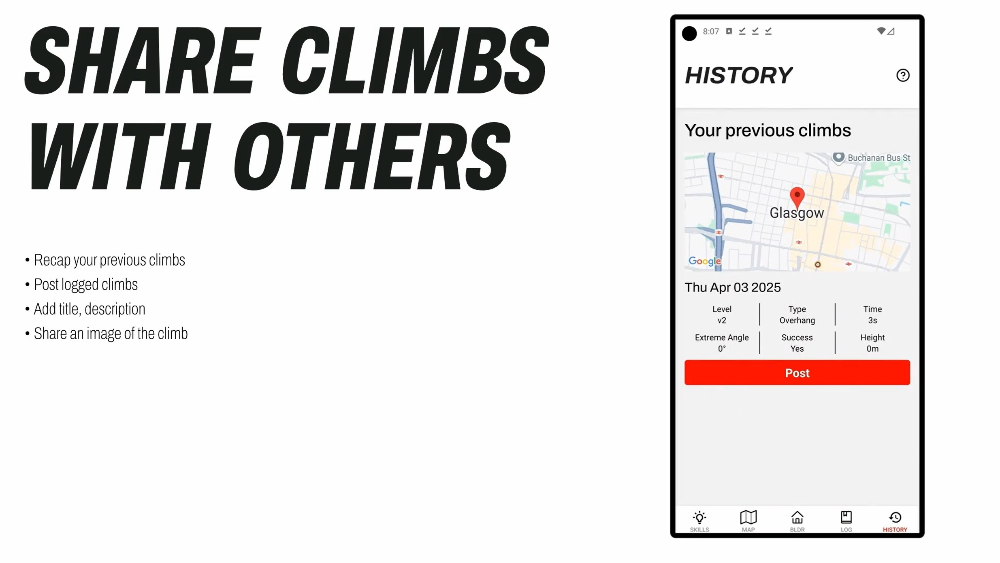

#### 12. Post screen

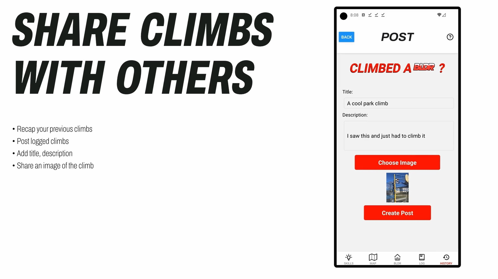
