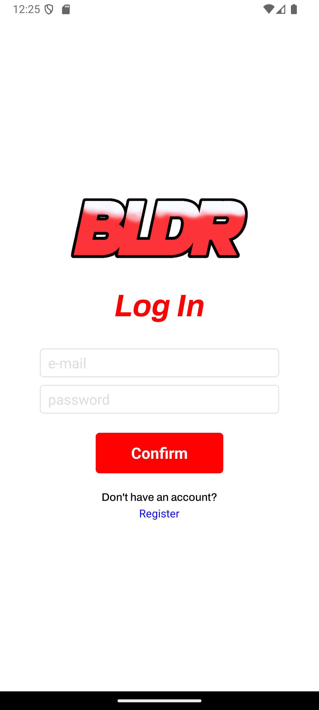
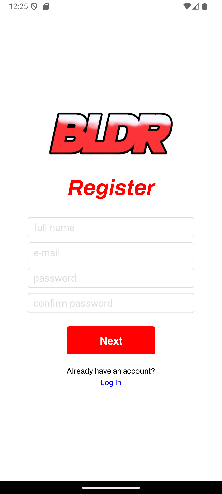
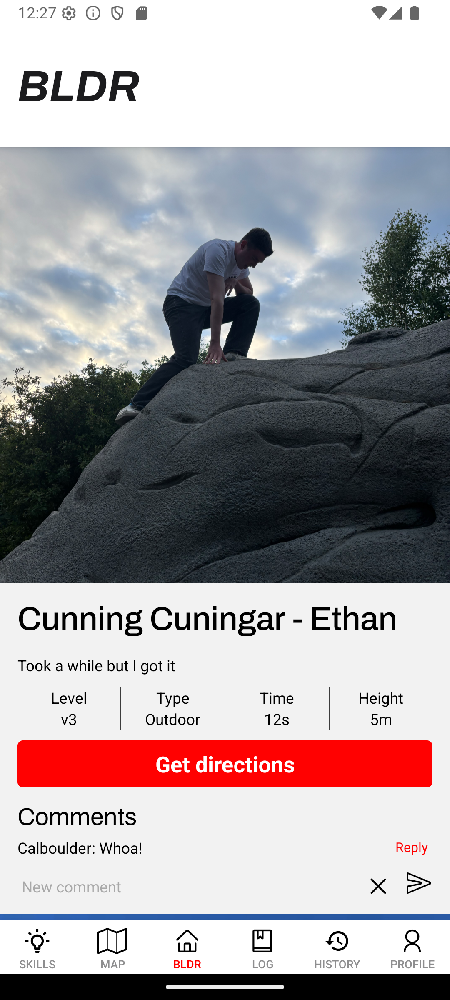
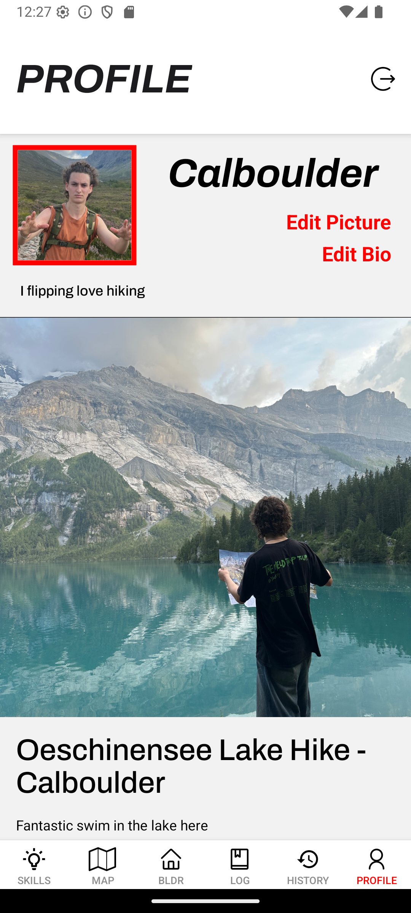
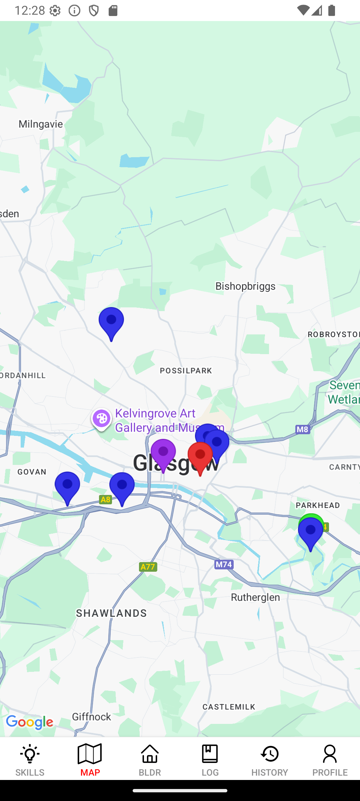
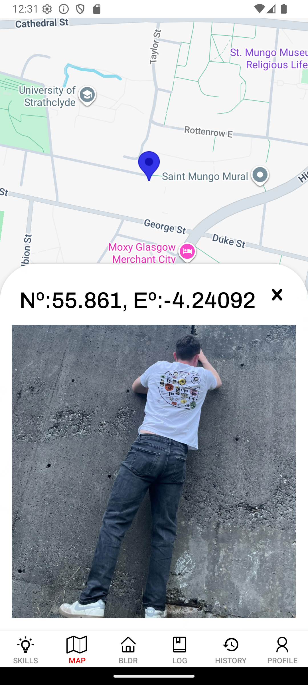
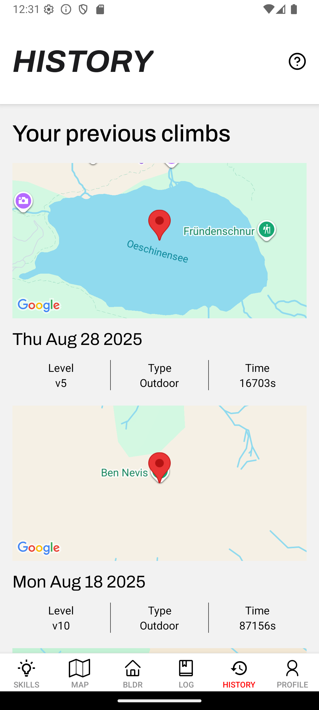
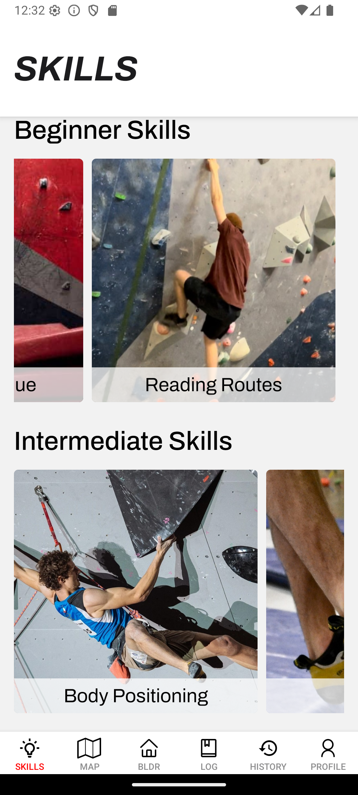
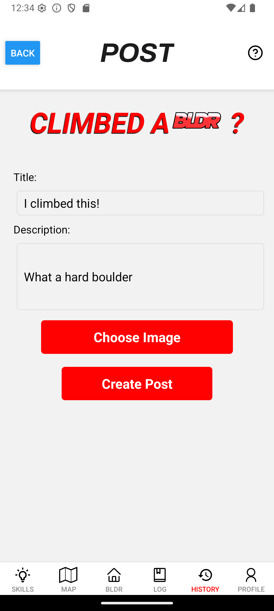
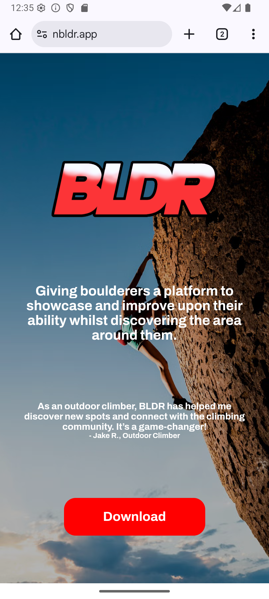

# BLDR

A climbing based social media app aiming to help foster community and personal skill.

Originally created for CS317: Mobile App Development, with University of Strathclyde.
Further work committed to enter for The Glasgow Inform Prize 2025.

## Featuring 

- Personalising your own BLDR account
- Tracking and logging your climbs via phone sensors
- Uploading selected climbs as a post to main page
- An interactive map, displaying preset and user posted locations
- A local skills page for quick tips and progression 

## App Walkthrough 

|      	|   	|  |
|-----------------------------------------------|---------------------------------------------------|--------------------------------------------|
| Login                                         | Register                                          | Home                                       |

|  	|           	|  |
|-----------------------------------------------|---------------------------------------------------|--------------------------------------------|
| Profile                                       | Map                                               | Map Point                                  |                      

|  	|       	|     |
|-----------------------------------------------|---------------------------------------------------|--------------------------------------------|
| History                                       | Skills                                            | Log                                        |                   

|       	|    |
|-----------------------------------------------|---------------------------------------------------|
| Post                                          | Download                                          | 

## Contributors

- [Ethan Midgley](https://github.com/ethanmidgley)
- [Mux Diven](https://github.com/muxdiven)
- [Jonasz Gofron](https://github.com/jonaszg)
- Kieran Ballard
